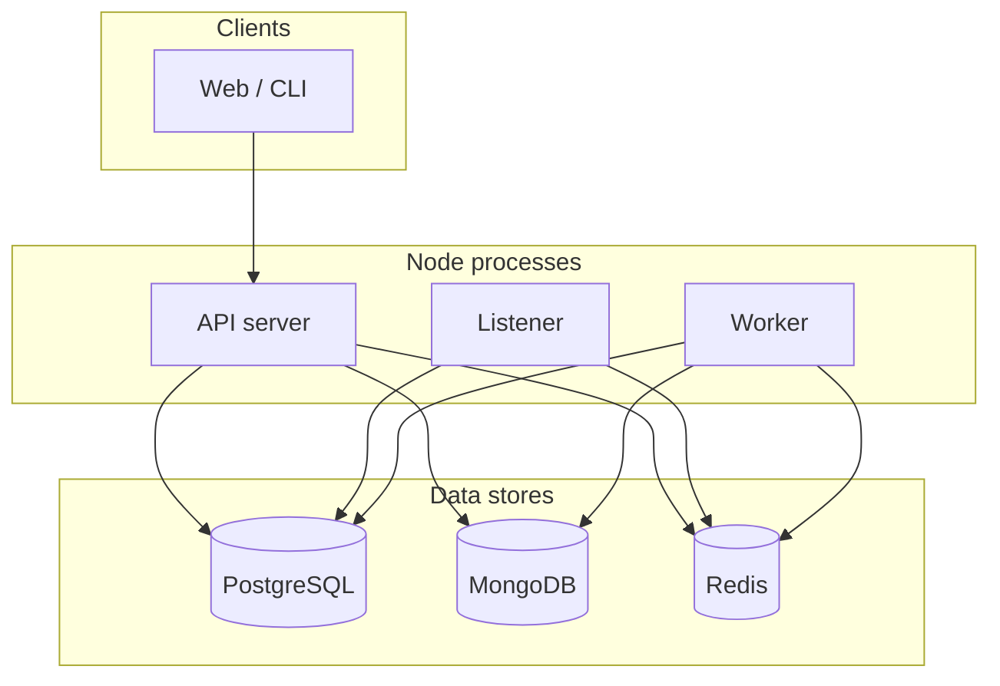
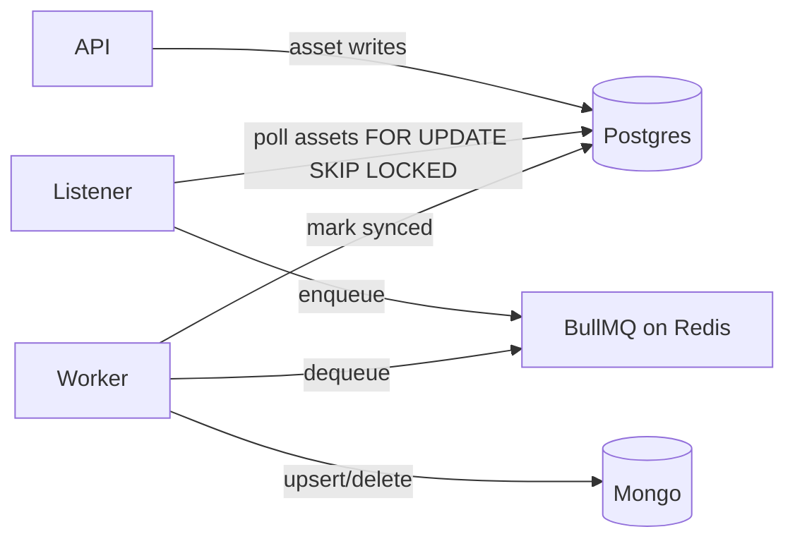
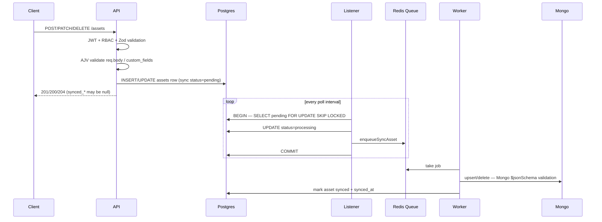
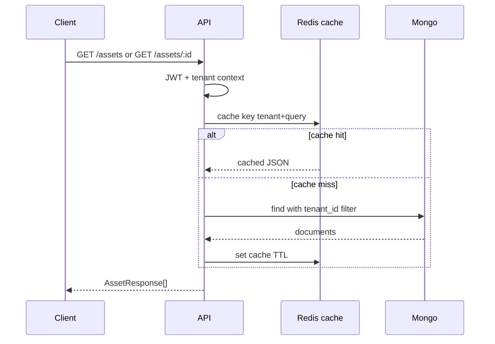
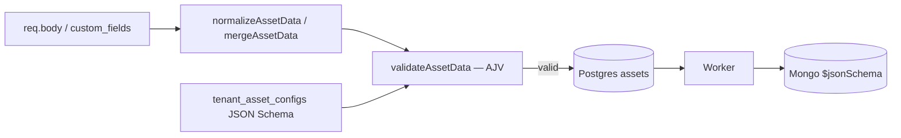
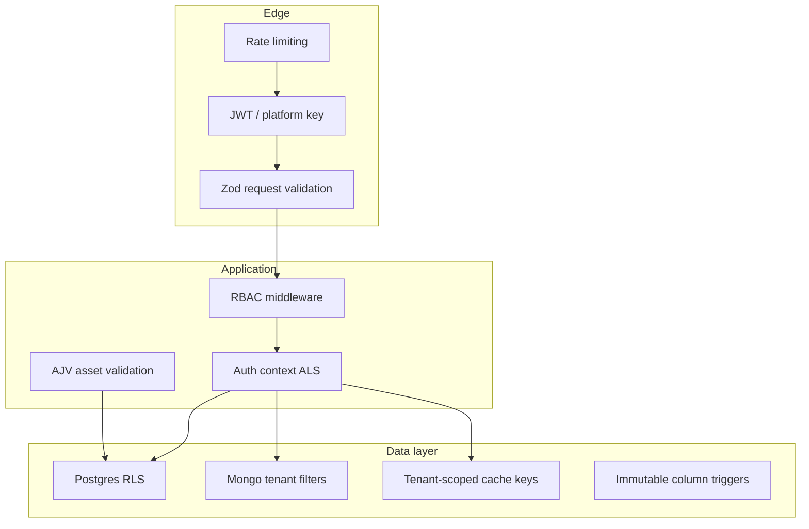
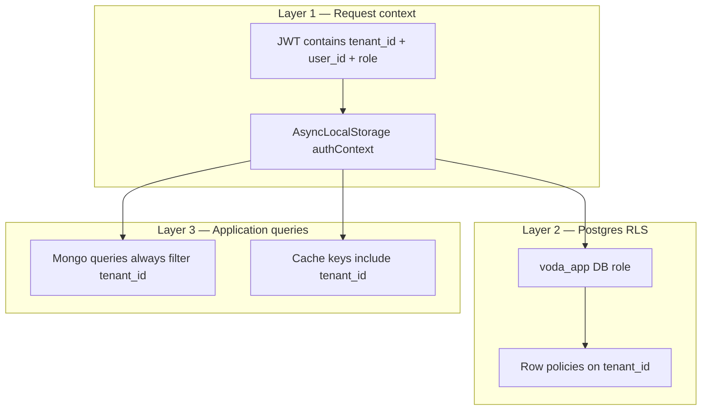

# Architecture & Design

This document explains how the multi-tenant asset service works end to end: components, data flow, security, patterns, and operational behavior. Reading it should give you the same mental model as walking through the codebase.

---

## Table of contents

1. [System overview](#1-system-overview)
2. [Process layout](#2-process-layout)
3. [Write path (create / update / delete)](#3-write-path-create--update--delete)
4. [Read path (list / get)](#4-read-path-list--get)
5. [Asset validation & dynamic metadata](#5-asset-validation--dynamic-metadata)
6. [Patterns & why](#6-patterns--why)
7. [Caching](#7-caching)
8. [Security](#8-security)
9. [Error handling](#9-error-handling)
10. [Source layout](#10-source-layout)

---

## 1. System overview

The service manages **tenants**, **users**, and **assets**. Each tenant is fully isolated: users and assets belong to exactly one tenant. Tenants can extend the base asset JSON Schema with custom fields (e.g. `material`, `diameter_mm`).

**Stores:**

| Store | Role |
|-------|------|
| **PostgreSQL** | ACID writes — source of truth for tenants, users, and asset mutations (embedded outbox), RLS |
| **MongoDB** | Asset **read model** — list/get, filters, aggregations (reports) |
| **Redis** | Response cache, rate-limit counters, BullMQ job queue |

**Why two databases for assets?** Asset **writes** go to Postgres for **ACID** transactions (atomic writes, outbox polling, tenant onboarding). Asset **reads** (`GET /assets`, reports) go to Mongo for fast queries and aggregations on the synced projection. Postgres holds the write model; Mongo holds the read model, updated asynchronously by the worker.



---

## 2. Process layout

Three long-running processes (PM2 in Docker, or separate terminals locally):

| Process | Entry | Responsibility |
|---------|-------|----------------|
| **API** | `src/index.ts` | HTTP, auth, validation, handlers |
| **Listener** | `src/listener.ts` | Poll `assets` with `FOR UPDATE SKIP LOCKED`, enqueue sync jobs |
| **Worker** | `src/worker.ts` | Consume queue, upsert/delete Mongo, mark synced |



The API never writes assets directly to Mongo on the request path. That keeps HTTP latency predictable and gives at-least-once sync with retries via the queue.

---

## 3. Write path (create / update / delete)

### 3.1 Flow diagram



### 3.2 Postgres asset row

On write, Postgres stores:

- `tenant_id`, `schema_version` — set on create, **immutable** (DB trigger)
- `data` — JSON blob: core attributes at root + tenant extensions in `custom_fields`
- `status` — **sync state**: `pending` → `processing` → `synced` (not business `ok/warning/critical`)
- `action` — `upsert` or `delete` (delete tombstone flow)
- `modified_by` — user who performed the write
- `synced_at` — set when worker confirms Mongo sync
- `created_at` — row creation time

The `assets` table is both the **write model** and the **outbox control plane** — there is no separate outbox table.

### 3.3 Outbox & concurrency-safe polling

To guarantee high-throughput stability and zero processing duplication across scaled out-of-process instances, the listener treats the `assets` table as a strict **system control plane** utilizing **pessimistic concurrency control**.

When polling for processing targets, the query locks records dynamically using a transaction-isolated cursor:

- **`FOR UPDATE`** — places an immediate lock on the selected rows, preventing concurrent polling processes from mutating or re-reading them.
- **`SKIP LOCKED`** — instructs parallel workers to immediately bypass locked records and process the next available rows in the stream without hanging.

**Lifecycle:** within the same transaction block, the listener updates the sync `status` of these rows to `processing` and dispatches them to BullMQ via Redis before executing a `COMMIT`, freeing up resources cleanly.

Poll query (conceptually):

```sql
SELECT id, tenant_id, modified_by
  FROM assets
 WHERE status = 'pending'
 ORDER BY created_at
 LIMIT $batch
 FOR UPDATE SKIP LOCKED;
```

If the worker fails after enqueue, BullMQ retries; idempotent Mongo upserts prevent duplicate documents. Rows left in `processing` can be recovered by a future poll policy or ops tooling.

### 3.4 Delete path

Delete sets `action=delete` and sync `status=pending`. Worker removes the Mongo document and Postgres hard-deletes the row after processing (tombstone flow).

### 3.5 API response timing

Create/update responses are built from Postgres immediately. Fields `synced_at`, `synced_by`, and `updated_at` are **null** until the worker completes. Clients that need the read model should poll `GET /assets/:id` or wait briefly.

---

## 4. Read path (list / get)

Asset reads are served from **MongoDB** (not Postgres). Postgres is only used on the write path; the worker projects accepted writes into Mongo for query-friendly access.



- **List:** filters `type`, `status`, pagination; Mongo query always includes `tenant_id`.
- **Get by id:** single document by `tenant_id` + `id`.
- **Reports:** `GET /reports/overview` combines Postgres (tenant, users, schema metadata) with Mongo aggregations (counts by status, schema version).

Cache keys are tenant-scoped. Writes invalidate cache entries — see [Caching](#7-caching).

---

## 5. Asset validation & dynamic metadata

Validation is **data-driven at runtime** — tenant constraints live as JSON Schema rows in Postgres, compiled and enforced by AJV on every write. No application redeploy is required to change tenant field rules.

### 5.1 Dynamic runtime metadata models

Asset attributes are split into immutable system tracking properties and structural tenant extensions. Instead of maintaining compiling schema versions or long-running database migrations, schema configuration is treated as **pure database rows**.

**Core attributes (root level):** Fields like `id`, `tenant_id`, `name`, `type`, `status`, `lat`, `lng`, and `installed_at` are strictly enforced by the core platform. They remain entirely flat at the document surface to enable rapid composite indexing and native geospatial query routing.

**Extended fields sandbox (`custom_fields`):** All tenant-specific parameters defined during the onboarding phase are stored under a dedicated `custom_fields` sub-document mapping (API may accept them at the top level; the server normalizes them into `custom_fields` before storage).

During tenant onboarding (`POST /tenants`), an enterprise’s structural validation constraints are stored directly as language-agnostic JSON Schema blocks in the **`tenant_asset_configs`** meta-table (implemented as `asset_schemas` in Postgres — one config row per tenant, insert-once).

**Atomic onboarding transaction:** `createTenantWithAdmin()` wraps all provisioning in one Postgres transaction (`withBypassTransaction` in `tenantRepository.ts`):

1. `INSERT` tenant row (`tenants`)
2. `INSERT` JSON Schema config row (`asset_schemas` / `tenant_asset_configs`)
3. `INSERT` first admin user (`users`)

If any step fails, the whole transaction rolls back — no orphaned tenant without a user or schema config. RLS is bypassed for this path only (no tenant context exists yet before the first user is created).

`tenant_id` and config binding on an asset row are **immutable** after create (DB triggers). Core platform fields cannot be overridden by tenant extensions.

### 5.2 Decoupled AJV validation engine

Rather than relying on application code changes, business validation is fully schema-driven and executed at the Express service boundary via **AJV** (Another JSON Schema Validator) in `lib/assetSchema.ts`:

| Step | Function | Purpose |
|------|----------|---------|
| Load config | `findLatestAssetSchema()` / `findAssetSchemaByVersion()` | Read JSON Schema from `tenant_asset_configs` |
| Normalize | `normalizeAssetData()` / `mergeAssetData()` | Server sets `id`, `tenant_id`; merges client fields into `custom_fields` |
| Compile | `compileAssetValidator()` | Build AJV validator from stored JSON Schema |
| Validate | `validateAssetData(schema, data)` | Runtime check against tenant rules |

**Zero-trust input separation:** Client updates (`PATCH /assets/:id`) are strictly limited to the `custom_fields` sub-document payload. Core infrastructure fields are parsed out-of-band by the server context, eliminating the risk of cross-tenant data pollution or spatial index corruption.

**Create (`POST /assets`)** — load current tenant config, normalize body, AJV validate, write Postgres with `status=pending`.

**Update (`PATCH /assets/:id`)** — load asset’s bound config, merge `custom_fields` patch, AJV validate, write Postgres.

Failed validation → `400` with `{ "error": "Asset validation failed", "details": [...] }`.



### 5.3 Mongo collection validator (second layer)

When the sync worker writes to Mongo, documents pass a **second validation** — Mongo’s native **`$jsonSchema`** collection validator on the `assets` collection (`assetMongoRepository.ts`, applied via `ensureAssetIndexes()`).

| Layer | Where | What it checks |
|-------|-------|----------------|
| **1 — AJV (API)** | `POST` / `PATCH` handlers | Full tenant JSON Schema: core fields + `custom_fields` rules |
| **2 — Mongo `$jsonSchema`** | `upsertAssetDocument()` | Document **shape**: required keys, BSON types, `status` enum, no extra top-level properties |

The Mongo validator is **structural** — it enforces that every synced document has the expected fields and types, but it does **not** re-run tenant-specific rules inside `custom_fields` (those are already enforced by AJV before Postgres accepts the write).

If Mongo validation fails, the worker job errors and BullMQ retries. In normal operation, AJV on the API path prevents invalid data from reaching Postgres, so Mongo validation acts as a **safety net** on the read model.

The end-to-end path is: **client payload → AJV (tenant config) → Postgres write model → worker → Mongo structural validator → read model.**

---

## 6. Patterns & why

| Pattern | Where | Why |
|---------|-------|-----|
| **Repository** | `repositories/*` | Hide SQL/Mongo behind stable interfaces per store |
| **Service layer** | `services/*` | Business rules, orchestration, error mapping |
| **Outbox** | `assets` table + listener | Embedded control plane; `FOR UPDATE SKIP LOCKED` polling |
| **Transactional onboarding** | `createTenantWithAdmin` | Tenant + schema config + admin user in one `BEGIN/COMMIT` |
| **Pessimistic concurrency** | Listener transaction | No duplicate enqueue across parallel pollers |
| **CQRS (light)** | PG write / Mongo read | Optimize each path independently |
| **Read model sync** | Worker + BullMQ | Retryable, scalable projection updates |
| **AsyncLocalStorage context** | `authContext` | Tenant/user available deep in stack without parameter drilling |
| **RLS** | Postgres policies | Defense in depth for multi-tenant SQL |
| **Zod validation** | `schemas.ts` + `validateRequest` | HTTP input validation separate from domain types (`types.ts`) |
| **AppError** | `lib/appError.ts` | Consistent HTTP error shape |
| **Response DTOs** | `lib/responses.ts` | API shapes decoupled from DB rows |

We did **not** use full event sourcing: the outbox is only for sync jobs, not a public event log.

---

## 7. Caching

Redis caches **read responses** for users and assets so repeated `GET` requests avoid hitting Postgres or Mongo on every call. Implemented in `lib/cache.ts`.

### What is cached

| Resource | Cached endpoints | Key includes |
|----------|------------------|--------------|
| **Assets** | `GET /assets` (list), `GET /assets/:id` | `tenant_id` + query params or asset `id` |
| **Users** | `GET /users` (list), `GET /users/:id` | `tenant_id` + pagination or user `id` |

Reports are **not** cached.

### When entries expire

Every cached value is stored with a **TTL** (time-to-live):

- Default: **60 seconds** (`CACHE_TTL_SECONDS` env var, default `60`)
- Redis command: `SET key value EX <TTL_SECONDS>`
- After TTL, the key is deleted automatically — the next request is a cache miss and reloads from the database

So a cached response lives for up to **60 seconds** (or whatever you configure), unless invalidated earlier.

### When entries are invalidated (removed early)

Cache is cleared **before TTL** when data changes, so clients do not read stale data for long:

| Event | Invalidation |
|-------|----------------|
| User create / update / delete | All user cache keys for that tenant (`invalidateTenantUsers`) |
| Asset create / update / delete (API) | All asset cache keys for that tenant (`invalidateTenantAssets`) |
| Asset sync (worker) | Same — worker calls `invalidateTenantAssets` after Mongo upsert/delete |

Invalidation uses `SCAN` + `DEL` on keys matching `tenant:{tenantId}:{resource}:*`.

### Cache key shape

```
tenant:{tenantId}:assets:{hash of sorted query params}
tenant:{tenantId}:users:{hash of sorted query params}
```

The hash covers `type`, `status`, `limit`, `offset` for asset lists, or `id` for single-resource keys. Tenant id in the key prevents cross-tenant cache leaks (see [Security](#8-security)).

---

## 8. Security

Security is layered: authentication, authorization, tenant isolation, input validation, rate limiting, and safe defaults at the database.

| Measure | Section | Summary |
|---------|---------|---------|
| Tenant isolation | [§8.1](#81-tenant-isolation) | JWT context, RLS, Mongo/cache tenant filters |
| Authentication | [§8.2](#82-authentication) | JWT Bearer, platform `x-admin-key`, public routes |
| RBAC | [§8.3](#83-role-based-access-control-rbac) | `admin` / `editor` / `viewer` role gates |
| Credential storage | [§8.4](#84-credential-storage) | bcrypt passwords, secrets in env only |
| Input validation | [§8.5](#85-input-validation) | Zod (HTTP), AJV (assets), Mongo `$jsonSchema` |
| Database hardening | [§8.6](#86-database-hardening) | RLS, immutable triggers, least-privilege grants |
| Rate limiting | [§8.7](#87-rate-limiting) | Redis-backed limits per user or IP |
| Safe error responses | [§8.8](#88-safe-error-responses) | No stack traces in API JSON |



### 8.1 Tenant isolation

Data from one tenant must never appear in another tenant’s responses. Enforced in **three layers**:



- **JWT + AsyncLocalStorage** — Login issues a JWT with `sub`, `tenant_id`, and `role`. Middleware (`middleware/auth.ts`) verifies the token and stores context in `lib/authContext.ts`. Repositories read `tenantId` from context; clients cannot override tenant scope via the request body.
- **Postgres RLS** — API uses `APP_DATABASE_URL` (`voda_app` role, not superuser). Row policies restrict `users`, `assets`, etc. to the current tenant. Superuser / seed connections bypass RLS only for migrations and seeding.
- **Mongo** — `assetMongoRepository` always filters by `tenant_id` from auth context.
- **Cache** — Keys are prefixed with `tenant:{tenantId}:…`.
- **Tests** — `tests/isolation.test.ts` verifies cross-tenant access fails.

### 8.2 Authentication

| Mode | Routes | Mechanism |
|------|--------|-----------|
| **Public** | `GET /health`, `POST /auth/login` | No token |
| **JWT Bearer** | All tenant-scoped routes | `Authorization: Bearer <token>` |
| **Platform key** | `POST /tenants` | `x-admin-key: PLATFORM_ADMIN_KEY` |

- JWT middleware (`requireAuthUnlessPublic`) runs on every request except JWT-exempt paths in `middleware/auth.ts`.
- Platform provisioning uses a shared secret header, separate from tenant JWTs — avoids needing a tenant before the first tenant exists (`middleware/platformAdmin.ts`).
- Invalid or missing credentials → `401`. Tokens signed with `JWT_SECRET` (`lib/jwt.ts`).

### 8.3 Role-based access control (RBAC)

Three roles per tenant: `admin`, `editor`, `viewer`.

| Capability | admin | editor | viewer |
|------------|:-----:|:------:|:------:|
| Users create/update/delete | ✓ | ✗ | ✗ |
| Users list/get | ✓ | ✓ | ✓ |
| Tenant update | ✓ | ✗ | ✗ |
| Assets create/update/delete | ✓ | ✓ | ✗ |
| Assets list/get | ✓ | ✓ | ✓ |
| Reports | ✓ | ✓ | ✓ |

Enforced by `middleware/authorize.ts`:

- `requireAdmin` — tenant `PUT`, user mutations
- `requireWrite` — asset mutations (admin + editor)

Denied actions → `403`.

### 8.4 Credential storage

- User passwords hashed with **bcrypt** before storage (`lib/password.ts`). Plain passwords never stored or returned in API responses.
- `PLATFORM_ADMIN_KEY` and `JWT_SECRET` are env secrets — not in code or responses.

### 8.5 Input validation

| Layer | Tool | Where | Purpose |
|-------|------|-------|---------|
| HTTP body/query/params | **Zod** | `schemas.ts` + `validateRequest` | Shape of API inputs (emails, UUIDs, pagination) |
| Asset business rules | **AJV** | `lib/assetSchema.ts` | Tenant JSON Schema on every asset create/update |
| Mongo documents | **$jsonSchema** | `assetMongoRepository` | Structural validation on sync (see [§5.3](#53-mongo-collection-validator-second-layer)) |

Invalid input → `400` with `{ error, details? }` — no write to Postgres.

### 8.6 Database hardening

- **Tenant context via AsyncLocalStorage** — the caller’s `tenant_id` is never taken from the request body or route params for authorization. Flow:

  1. JWT middleware verifies the token and stores `tenantId`, `userId`, and `role` in **AsyncLocalStorage** (`lib/authContext.ts`).
  2. Repositories read `getTenantId()` from that context — handlers and services do not pass `tenant_id` as an untrusted application parameter.
  3. **Postgres** — every scoped query runs inside a short transaction that sets `app.current_tenant_id` from AsyncLocalStorage (`clients/postgres.ts` → `query()`). RLS policies filter rows automatically; most `SELECT`/`UPDATE`/`DELETE` SQL does not need `tenant_id` in the query string because the session variable enforces scope. `INSERT` statements set `tenant_id` from `getTenantId()` (required `NOT NULL` column, still must match RLS `WITH CHECK`).
  4. **Mongo** — repositories explicitly add `tenant_id: getTenantId()` to every filter (Mongo has no RLS).

  This keeps tenant scoping consistent deep in the stack without trusting client-supplied tenant ids.

- **RLS** on tenant-scoped Postgres tables (see §8.1).
- **Immutable columns (triggers)** — even if the API has a bug, Postgres rejects illegal changes:

| Table | What cannot change after create | What can change |
|-------|--------------------------------|-----------------|
| **users** | `tenant_id` (user cannot move to another tenant) | `name`, `email`, `password_hash`, `role` (via API + RBAC) |
| **assets** | `tenant_id`, `schema_version` | `data`, sync/outbox fields, `modified_by` |
| **asset_schemas** | entire row (no UPDATE or DELETE at all) | nothing — insert once at tenant create |
| **tenants** | `id` (implicit) | `name`, `slug` — **admins** can update via `PUT /tenants/current` |

- **Mongo immutability** — `upsertAssetDocument` rejects changes to `tenant_id` or `schema_version` on existing documents.
- **Least privilege (`voda_app` grants)** — not the same for every table:

| Table | `voda_app` can UPDATE/DELETE? | Notes |
|-------|------------------------------|--------|
| `asset_schemas` | **No** (`REVOKE UPDATE, DELETE`) | Schemas provisioned only at tenant create (bypass RLS insert) |
| `tenants` | **Yes** (within RLS) | Tenant **metadata** (`name`, `slug`) — not the same as locking the row |
| `users`, `assets` | **Yes** (within RLS) | Scoped to current tenant; `users.tenant_id` still immutable via trigger |

So: users **cannot** reassign themselves to another tenant (`users.tenant_id` trigger). Tenant **admins** **can** update their organization’s name/slug. Nobody can change `asset_schemas` after provisioning — that restriction is stricter than tenants.

### 8.7 Rate limiting

`middleware/rateLimit.ts` uses **express-rate-limit** with a **Redis store** so limits are shared across all API processes (not per-process memory).

| Setting | Default | Env var |
|---------|---------|---------|
| Window | 60 seconds | `RATE_LIMIT_WINDOW_MS` |
| Max requests per window | 100 | `RATE_LIMIT_MAX` |

- **`GET /health`** — skipped (not rate limited).
- **Authenticated requests** — limited per **user + tenant** (`user:{tenantId}:{userId}`).
- **Public routes** (e.g. `POST /auth/login`) — limited per **client IP**.
- Over limit → `429` with `{ "error": "Too many requests, please try again later" }`.
- Response includes `RateLimit-*` headers (`standardHeaders: draft-7`).

Protects against brute-force login attempts and noisy clients without blocking an entire tenant when one user is active.

### 8.8 Safe error responses

Unhandled errors log server-side but return a generic `500` message — no stack traces or internal details in JSON responses (`app.ts` error handler).

---

## 9. Error handling

Central flow:

1. Zod / `validateRequest` → `400` + flattened `details`
2. `AppError` in services → mapped status + `{ error, details? }`
3. Unhandled → `500` + generic message (no stack in response)

Common statuses: `400` validation, `401` auth, `403` RBAC, `404` not found, `409` conflict, `429` rate limit.

Asset schema validation failures return `400` with structured `details` from JSON Schema validation.

---

## 10. Source layout

Lean, store-native layout — each process has a single entry file; data access is isolated per database.

```
src/
  index.ts              API server entry
  listener.ts           Concurrency-safe outbox poller (assets FOR UPDATE SKIP LOCKED)
  worker.ts             Mongo sync consumer (BullMQ)
  app.ts                Express wiring + global middleware

  clients/              Database connections (postgres, mongo, redis)
  lib/                  Cross-cutting: jwt, authContext, password, cache,
                        assetSchema (AJV), responses, appError
  middleware/           auth, authorize, validateRequest (Zod), rateLimit,
                        platformAdmin, asyncHandler
  repositories/         One repository per store / aggregate
                          assetRepository.ts      Postgres write model + outbox polling
                          assetMongoRepository.ts Mongo read model + $jsonSchema validator
                          tenantRepository.ts     tenants + tenant_asset_configs
                          userRepository.ts       users (RLS-scoped)
  routes/               Thin HTTP handlers: auth, tenants, users, assets, reports
  services/             Business logic: auth, tenant, user, asset, report
  worker/
    syncAsset.ts        BullMQ queue definition + enqueueSyncAsset

  schemas.ts            Zod HTTP input schemas
  types.ts              Domain types (Asset, User, Tenant, …)
```

**Data flow summary:**

1. **Tenant onboarding** (`POST /tenants`) — single transaction: tenant + `tenant_asset_configs` + admin user (rollback on any failure; RLS bypass).
2. **User CRUD** → Postgres only (RLS + triggers).
3. **Asset write** → Zod → AJV (`custom_fields`) → Postgres `assets` (`pending`) → listener (`FOR UPDATE SKIP LOCKED`, `processing`) → BullMQ → worker → Mongo `$jsonSchema` → `synced`.
4. **Asset read** → Redis cache → Mongo (tenant-scoped query).
5. **Report** → Postgres metadata + Mongo aggregations.

---

## Quick reference: consistency expectations

| Operation | Immediate source | Fully consistent when |
|-----------|------------------|------------------------|
| Login / users | Postgres | Same request |
| Asset write response | Postgres | Sync fields null until worker |
| Asset read | Mongo | After worker sync |
| Report asset counts | Mongo | After worker sync |

This is **eventual consistency** between Postgres write model and Mongo read model, typically seconds under normal load.
