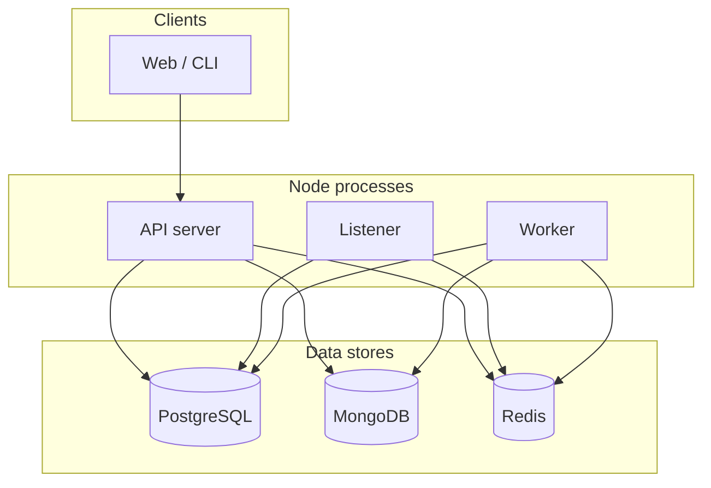
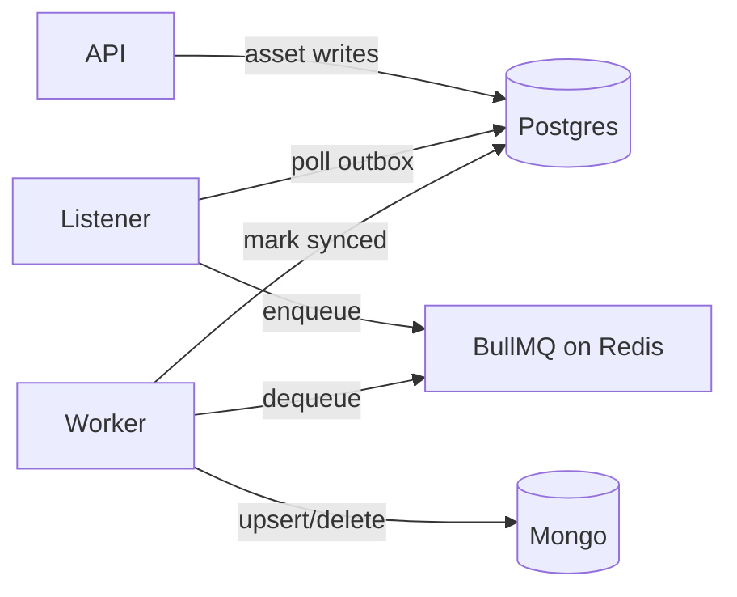
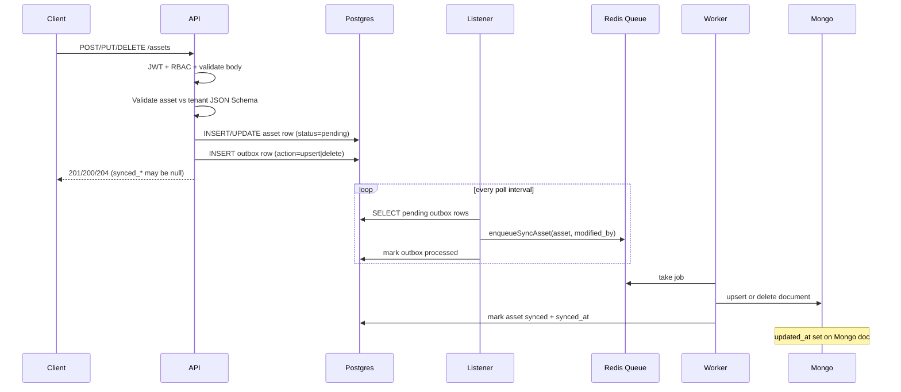
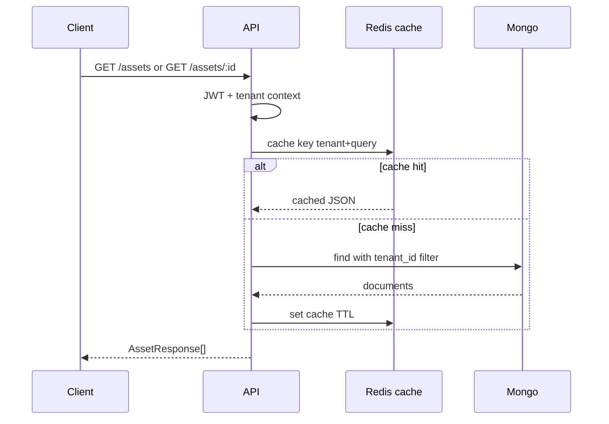
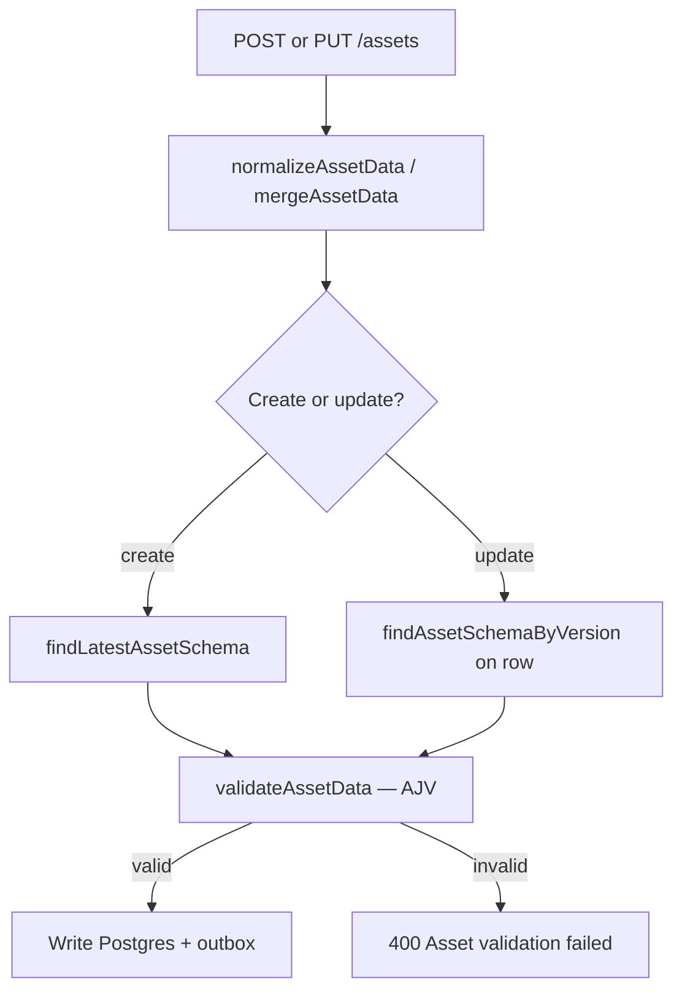
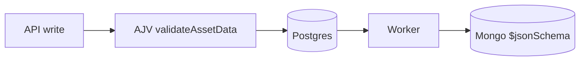
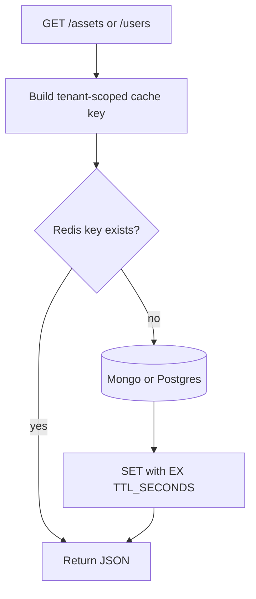
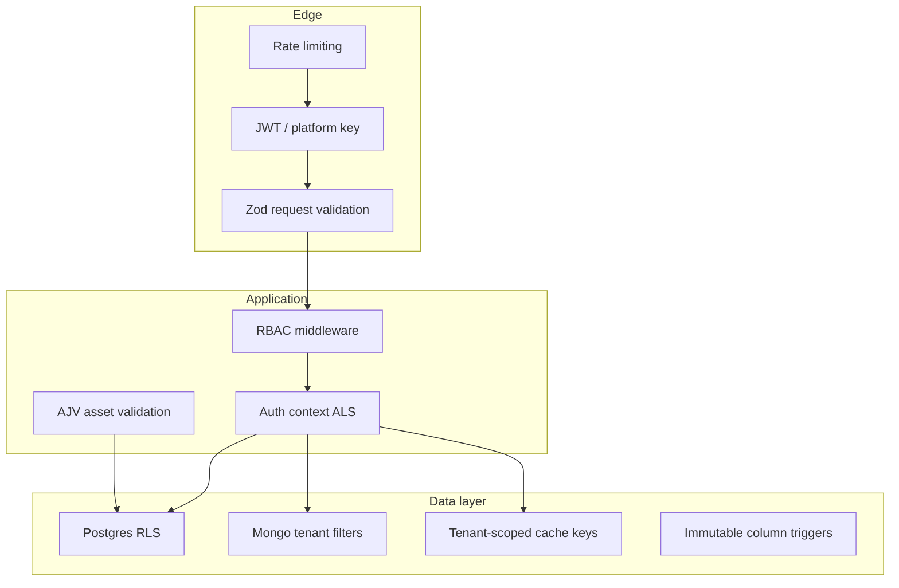
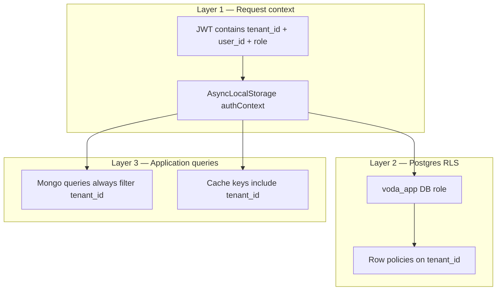

# Architecture & Design

This document explains how the multi-tenant asset service works end to end: components, data flow, security, patterns, and operational behavior. Reading it should give you the same mental model as walking through the codebase.

---

## Table of contents

1. [System overview](#1-system-overview)
2. [Process layout](#2-process-layout)
3. [Write path (create / update / delete)](#3-write-path-create--update--delete)
4. [Read path (list / get)](#4-read-path-list--get)
5. [Asset schema versioning & validation](#5-asset-schema-versioning--validation)
6. [Patterns & why](#6-patterns--why)
7. [Caching](#7-caching)
8. [Security](#8-security)
9. [Error handling](#9-error-handling)
10. [Source layout](#10-source-layout)

---

## 1. System overview

The service manages **tenants**, **users**, and **assets**. Each tenant is fully isolated: users and assets belong to exactly one tenant. Tenants can extend the base asset JSON Schema with custom fields (e.g. `material`, `diameter_mm`).

**Stores:**

| Store | Role |
|-------|------|
| **PostgreSQL** | Source of truth for tenants, users, asset writes, outbox, RLS |
| **MongoDB** | Read model for assets (fast queries, aggregations) |
| **Redis** | Response cache, rate-limit counters, BullMQ job queue |

**Why two databases for assets?** Writes need transactional consistency and an outbox; reads need flexible filtering and aggregations without heavy Postgres JSON work. Postgres holds the write model; Mongo holds the read model, synced asynchronously.



---

## 2. Process layout

Three long-running processes (PM2 in Docker, or separate terminals locally):

| Process | Entry | Responsibility |
|---------|-------|----------------|
| **API** | `src/index.ts` | HTTP, auth, validation, handlers |
| **Listener** | `src/listener.ts` | Poll Postgres outbox, enqueue sync jobs |
| **Worker** | `src/worker.ts` | Consume queue, upsert/delete Mongo, mark synced |



The API never writes assets directly to Mongo on the request path. That keeps HTTP latency predictable and gives at-least-once sync with retries via the queue.

---

## 3. Write path (create / update / delete)

### 3.1 Flow diagram



### 3.2 Postgres asset row

On write, Postgres stores:

- `tenant_id`, `schema_version` — set on create, **immutable** (DB trigger)
- `data` — JSON blob (base fields + `extra_fields`)
- `status` — **sync state**: `pending` → `synced` (not business `ok/warning/critical`)
- `modified_by` — user who performed the write
- `synced_at` — set when worker confirms Mongo sync
- `created_at`, `updated_at` — `updated_at` null until sync for eventual consistency with Mongo

### 3.3 Outbox

Each asset mutation also inserts an **outbox** row: `asset_id`, `tenant_id`, `action` (`upsert` | `delete`), payload snapshot. The listener polls unprocessed rows, pushes jobs to BullMQ, then marks outbox processed. If the worker fails, jobs retry; idempotent upserts prevent duplicate documents.

### 3.4 Delete path

Delete sets outbox `action=delete`. Worker removes the Mongo document and Postgres may hard-delete the row after processing (tombstone flow).

### 3.5 API response timing

Create/update responses are built from Postgres immediately. Fields `synced_at`, `synced_by`, and `updated_at` are **null** until the worker completes. Clients that need the read model should poll `GET /assets/:id` or wait briefly.

---

## 4. Read path (list / get)



- **List:** filters `type`, `status`, pagination; Mongo query always includes `tenant_id`.
- **Get by id:** single document by `tenant_id` + `id`.
- **Reports:** `GET /reports/overview` combines Postgres (tenant, users, schema metadata) with Mongo aggregations (counts by status, schema version).

Cache keys are tenant-scoped. Writes invalidate cache entries — see [Caching](#7-caching).

---

## 5. Asset schema versioning & validation

Each tenant has a JSON Schema for assets stored in Postgres (`asset_schemas` table) with an integer `version`. The API exposes labels like `v_1`, `v_2`, … via `formatSchemaVersion()` in `lib/responses.ts`.

### 5.1 Base schema + tenant extensions

- **Base schema** (`seed/schemas/default-asset.schema.json`, built in `lib/assetSchema.ts`): `id`, `tenant_id`, `name`, `type`, `status`, `lat`, `lng`, `installed_at`, and optional `extra_fields`.
- **Tenant extension** (on `POST /tenants`): custom properties merged into `extra_fields` in the JSON Schema. Base fields cannot be removed or overridden.
- **Immutable on asset row**: `tenant_id` and `schema_version` are set on create and cannot change (Postgres trigger). An asset always keeps the schema version it was created with.

Custom tenant fields are sent at the top level in API requests; they are normalized into `extra_fields` in stored data and appear under `extra_fields` in API responses.

### 5.2 AJV validation on every write (API layer)

Asset **business validation** runs in the API using **AJV** (`ajv` + `ajv-formats`) in `lib/assetSchema.ts`:

| Step | Function | Purpose |
|------|----------|---------|
| Compile schema | `compileAssetValidator()` | Builds an AJV validator from the tenant JSON Schema |
| Validate data | `validateAssetData(schema, data)` | Runs AJV against normalized asset data |
| Format errors | `formatErrors()` | Returns paths like `/name: must be string` |

**Create (`POST /assets`)**

1. Load the tenant’s **current** schema via `findLatestAssetSchema()`.
2. Normalize the flat request body with `normalizeAssetData()` (sets `id`, `tenant_id`, merges custom fields into `extra_fields`).
3. Validate with AJV against that schema.
4. On success, insert into Postgres with `schema_version = latest.version` (e.g. `1` → API shows `v_1`).

**Update (`PUT /assets/:id`)**

1. Load the existing asset from Postgres.
2. Load the schema for **that asset’s `schema_version`** via `findAssetSchemaByVersion(existing.schema_version)` — not the latest tenant schema.
3. Merge the patch with `mergeAssetData()`.
4. Validate the merged data with AJV against the **same version** the asset was created with.
5. On success, update Postgres (`schema_version` stays unchanged).

This means older assets remain valid under the rules they were created with, even if the tenant schema definition changes in the future.

Failed validation returns `400` with `{ "error": "Asset validation failed", "details": [...] }`.



### 5.3 Mongo collection validator (second layer)

When the sync worker writes to Mongo, documents pass a **second validation** — Mongo’s native **`$jsonSchema`** collection validator on the `assets` collection (`assetMongoRepository.ts`, applied via `ensureAssetIndexes()`).

| Layer | Where | What it checks |
|-------|-------|----------------|
| **1 — AJV (API)** | `POST` / `PUT` handlers | Full tenant JSON Schema: base fields + tenant `extra_fields` rules |
| **2 — Mongo `$jsonSchema`** | `upsertAssetDocument()` | Document **shape**: required keys, BSON types, `status` enum, no extra top-level properties |

The Mongo validator is **structural** — it enforces that every synced document has the expected fields and types, but it does **not** re-run tenant-specific rules inside `extra_fields` (those are already enforced by AJV before Postgres accepts the write).

If Mongo validation fails, the worker job errors and BullMQ retries. In normal operation, AJV on the API path prevents invalid data from reaching Postgres, so Mongo validation acts as a **safety net** on the read model.



### 5.4 Version labels in the API

| Store | `schema_version` format | Example |
|-------|-------------------------|---------|
| Postgres / Mongo | integer | `1` |
| API responses / reports | string label | `v_1` |

The version on an asset row is set at create time and copied into the Mongo document on sync. Reports can aggregate assets by `schema_version` to show how many assets exist per version.

---

## 6. Patterns & why

| Pattern | Where | Why |
|---------|-------|-----|
| **Repository** | `repositories/*` | Hide SQL/Mongo behind stable interfaces per store |
| **Service layer** | `services/*` | Business rules, orchestration, error mapping |
| **Outbox** | Postgres `outbox` + listener | Reliable handoff to async sync without dual-write races |
| **Transactional outbox** | Same DB transaction as asset row | No lost events if API crashes after write |
| **CQRS (light)** | PG write / Mongo read | Optimize each path independently |
| **Read model sync** | Worker + BullMQ | Retryable, scalable projection updates |
| **AsyncLocalStorage context** | `authContext` | Tenant/user available deep in stack without parameter drilling |
| **RLS** | Postgres policies | Defense in depth for multi-tenant SQL |
| **Zod validation** | `schemas.ts` + `validateRequest` | HTTP input validation separate from domain types (`types.ts`) |
| **AppError** | `lib/appError.ts` | Consistent HTTP error shape |
| **Response DTOs** | `lib/responses.ts` | API shapes decoupled from DB rows |

We did **not** use full event sourcing: the outbox is only for sync jobs, not a public event log.

---

## 7. Caching

Redis caches **read responses** for users and assets so repeated `GET` requests avoid hitting Postgres or Mongo on every call. Implemented in `lib/cache.ts`.

### What is cached

| Resource | Cached endpoints | Key includes |
|----------|------------------|--------------|
| **Assets** | `GET /assets` (list), `GET /assets/:id` | `tenant_id` + query params or asset `id` |
| **Users** | `GET /users` (list), `GET /users/:id` | `tenant_id` + pagination or user `id` |

Reports are **not** cached.

### When entries expire

Every cached value is stored with a **TTL** (time-to-live):

- Default: **60 seconds** (`CACHE_TTL_SECONDS` env var, default `60`)
- Redis command: `SET key value EX <TTL_SECONDS>`
- After TTL, the key is deleted automatically — the next request is a cache miss and reloads from the database

So a cached response lives for up to **60 seconds** (or whatever you configure), unless invalidated earlier.

### When entries are invalidated (removed early)

Cache is cleared **before TTL** when data changes, so clients do not read stale data for long:

| Event | Invalidation |
|-------|----------------|
| User create / update / delete | All user cache keys for that tenant (`invalidateTenantUsers`) |
| Asset create / update / delete (API) | All asset cache keys for that tenant (`invalidateTenantAssets`) |
| Asset sync (worker) | Same — worker calls `invalidateTenantAssets` after Mongo upsert/delete |

Invalidation uses `SCAN` + `DEL` on keys matching `tenant:{tenantId}:{resource}:*`.

### Cache key shape

```
tenant:{tenantId}:assets:{hash of sorted query params}
tenant:{tenantId}:users:{hash of sorted query params}
```

The hash covers `type`, `status`, `limit`, `offset` for asset lists, or `id` for single-resource keys. Tenant id in the key prevents cross-tenant cache leaks (see [Security](#8-security)).



---

## 8. Security

Security is layered: authentication, authorization, tenant isolation, input validation, rate limiting, and safe defaults at the database.

| Measure | Section | Summary |
|---------|---------|---------|
| Tenant isolation | [§8.1](#81-tenant-isolation) | JWT context, RLS, Mongo/cache tenant filters |
| Authentication | [§8.2](#82-authentication) | JWT Bearer, platform `x-admin-key`, public routes |
| RBAC | [§8.3](#83-role-based-access-control-rbac) | `admin` / `editor` / `viewer` role gates |
| Credential storage | [§8.4](#84-credential-storage) | bcrypt passwords, secrets in env only |
| Input validation | [§8.5](#85-input-validation) | Zod (HTTP), AJV (assets), Mongo `$jsonSchema` |
| Database hardening | [§8.6](#86-database-hardening) | RLS, immutable triggers, least-privilege grants |
| Rate limiting | [§8.7](#87-rate-limiting) | Redis-backed limits per user or IP |
| Safe error responses | [§8.8](#88-safe-error-responses) | No stack traces in API JSON |



### 8.1 Tenant isolation

Data from one tenant must never appear in another tenant’s responses. Enforced in **three layers**:



- **JWT + AsyncLocalStorage** — Login issues a JWT with `sub`, `tenant_id`, and `role`. Middleware (`middleware/auth.ts`) verifies the token and stores context in `lib/authContext.ts`. Repositories read `tenantId` from context; clients cannot override tenant scope via the request body.
- **Postgres RLS** — API uses `APP_DATABASE_URL` (`voda_app` role, not superuser). Row policies restrict `users`, `assets`, etc. to the current tenant. Superuser / seed connections bypass RLS only for migrations and seeding.
- **Mongo** — `assetMongoRepository` always filters by `tenant_id` from auth context.
- **Cache** — Keys are prefixed with `tenant:{tenantId}:…`.
- **Tests** — `tests/isolation.test.ts` verifies cross-tenant access fails.

### 8.2 Authentication

| Mode | Routes | Mechanism |
|------|--------|-----------|
| **Public** | `GET /health`, `POST /auth/login` | No token |
| **JWT Bearer** | All tenant-scoped routes | `Authorization: Bearer <token>` |
| **Platform key** | `POST /tenants` | `x-admin-key: PLATFORM_ADMIN_KEY` |

- JWT middleware (`requireAuthUnlessPublic`) runs on every request except JWT-exempt paths in `middleware/auth.ts`.
- Platform provisioning uses a shared secret header, separate from tenant JWTs — avoids needing a tenant before the first tenant exists (`middleware/platformAdmin.ts`).
- Invalid or missing credentials → `401`. Tokens signed with `JWT_SECRET` (`lib/jwt.ts`).

### 8.3 Role-based access control (RBAC)

Three roles per tenant: `admin`, `editor`, `viewer`.

| Capability | admin | editor | viewer |
|------------|:-----:|:------:|:------:|
| Users create/update/delete | ✓ | ✗ | ✗ |
| Users list/get | ✓ | ✓ | ✓ |
| Tenant update | ✓ | ✗ | ✗ |
| Assets create/update/delete | ✓ | ✓ | ✗ |
| Assets list/get | ✓ | ✓ | ✓ |
| Reports | ✓ | ✓ | ✓ |

Enforced by `middleware/authorize.ts`:

- `requireAdmin` — tenant `PUT`, user mutations
- `requireWrite` — asset mutations (admin + editor)

Denied actions → `403`.

### 8.4 Credential storage

- User passwords hashed with **bcrypt** before storage (`lib/password.ts`). Plain passwords never stored or returned in API responses.
- `PLATFORM_ADMIN_KEY` and `JWT_SECRET` are env secrets — not in code or responses.

### 8.5 Input validation

| Layer | Tool | Where | Purpose |
|-------|------|-------|---------|
| HTTP body/query/params | **Zod** | `schemas.ts` + `validateRequest` | Shape of API inputs (emails, UUIDs, pagination) |
| Asset business rules | **AJV** | `lib/assetSchema.ts` | Tenant JSON Schema on every asset create/update |
| Mongo documents | **$jsonSchema** | `assetMongoRepository` | Structural validation on sync (see [§5.3](#53-mongo-collection-validator-second-layer)) |

Invalid input → `400` with `{ error, details? }` — no write to Postgres.

### 8.6 Database hardening

- **RLS** on tenant-scoped Postgres tables (see §8.1).
- **Immutable columns (triggers)** — even if the API has a bug, Postgres rejects illegal changes:

| Table | What cannot change after create | What can change |
|-------|--------------------------------|-----------------|
| **users** | `tenant_id` (user cannot move to another tenant) | `name`, `email`, `password_hash`, `role` (via API + RBAC) |
| **assets** | `tenant_id`, `schema_version` | `data`, sync/outbox fields, `modified_by` |
| **asset_schemas** | entire row (no UPDATE or DELETE at all) | nothing — insert once at tenant create |
| **tenants** | `id` (implicit) | `name`, `slug` — **admins** can update via `PUT /tenants/current` |

- **Mongo immutability** — `upsertAssetDocument` rejects changes to `tenant_id` or `schema_version` on existing documents.
- **Least privilege (`voda_app` grants)** — not the same for every table:

| Table | `voda_app` can UPDATE/DELETE? | Notes |
|-------|------------------------------|--------|
| `asset_schemas` | **No** (`REVOKE UPDATE, DELETE`) | Schemas provisioned only at tenant create (bypass RLS insert) |
| `tenants` | **Yes** (within RLS) | Tenant **metadata** (`name`, `slug`) — not the same as locking the row |
| `users`, `assets` | **Yes** (within RLS) | Scoped to current tenant; `users.tenant_id` still immutable via trigger |

So: users **cannot** reassign themselves to another tenant (`users.tenant_id` trigger). Tenant **admins** **can** update their organization’s name/slug. Nobody can change `asset_schemas` after provisioning — that restriction is stricter than tenants.

### 8.7 Rate limiting

`middleware/rateLimit.ts` uses **express-rate-limit** with a **Redis store** so limits are shared across all API processes (not per-process memory).

| Setting | Default | Env var |
|---------|---------|---------|
| Window | 60 seconds | `RATE_LIMIT_WINDOW_MS` |
| Max requests per window | 100 | `RATE_LIMIT_MAX` |

- **`GET /health`** — skipped (not rate limited).
- **Authenticated requests** — limited per **user + tenant** (`user:{tenantId}:{userId}`).
- **Public routes** (e.g. `POST /auth/login`) — limited per **client IP**.
- Over limit → `429` with `{ "error": "Too many requests, please try again later" }`.
- Response includes `RateLimit-*` headers (`standardHeaders: draft-7`).

Protects against brute-force login attempts and noisy clients without blocking an entire tenant when one user is active.

### 8.8 Safe error responses

Unhandled errors log server-side but return a generic `500` message — no stack traces or internal details in JSON responses (`app.ts` error handler).

---

## 9. Error handling

Central flow:

1. Zod / `validateRequest` → `400` + flattened `details`
2. `AppError` in services → mapped status + `{ error, details? }`
3. Unhandled → `500` + generic message (no stack in response)

Common statuses: `400` validation, `401` auth, `403` RBAC, `404` not found, `409` conflict, `429` rate limit.

Asset schema validation failures return `400` with structured `details` from JSON Schema validation.

---

## 10. Source layout

```
src/
  index.ts          API entry
  listener.ts       Outbox poller
  worker.ts         Sync consumer
  app.ts            Express app wiring

  clients/          postgres, mongo, redis connections
  lib/              jwt, authContext, password, cache, assetSchema,
                    responses, appError
  middleware/       auth, authorize, validateRequest, rateLimit,
                    platformAdmin, asyncHandler
  repositories/     assetRepository (PG), assetMongoRepository (MG),
                    tenantRepository, userRepository
  routes/           auth, tenants, users, assets, reports
  services/         auth, tenant, user, asset, report
  worker/
    syncAsset.ts    BullMQ queue + enqueueSyncAsset

  schemas.ts        Zod input schemas
  types.ts          Domain types
```

**Data flow summary:**

1. **Tenant onboarding** (`POST /tenants`) → Postgres tenant + admin user + schema; no Mongo yet.
2. **User CRUD** → Postgres only.
3. **Asset write** → Postgres + outbox → listener → queue → worker → Mongo.
4. **Asset read** → Mongo (+ cache).
5. **Report** → Postgres + Mongo aggregates.

---

## Quick reference: consistency expectations

| Operation | Immediate source | Fully consistent when |
|-----------|------------------|------------------------|
| Login / users | Postgres | Same request |
| Asset write response | Postgres | Sync fields null until worker |
| Asset read | Mongo | After worker sync |
| Report asset counts | Mongo | After worker sync |

This is **eventual consistency** between Postgres write model and Mongo read model, typically seconds under normal load.
