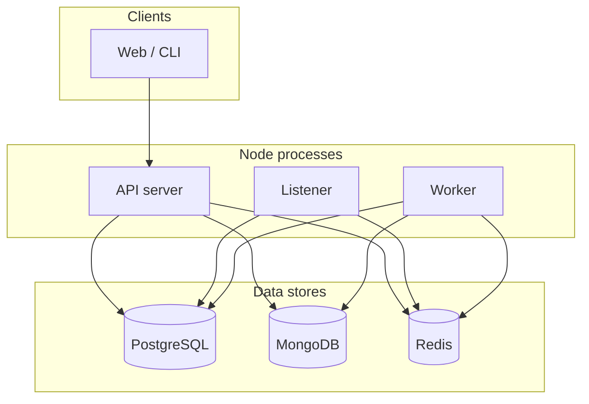
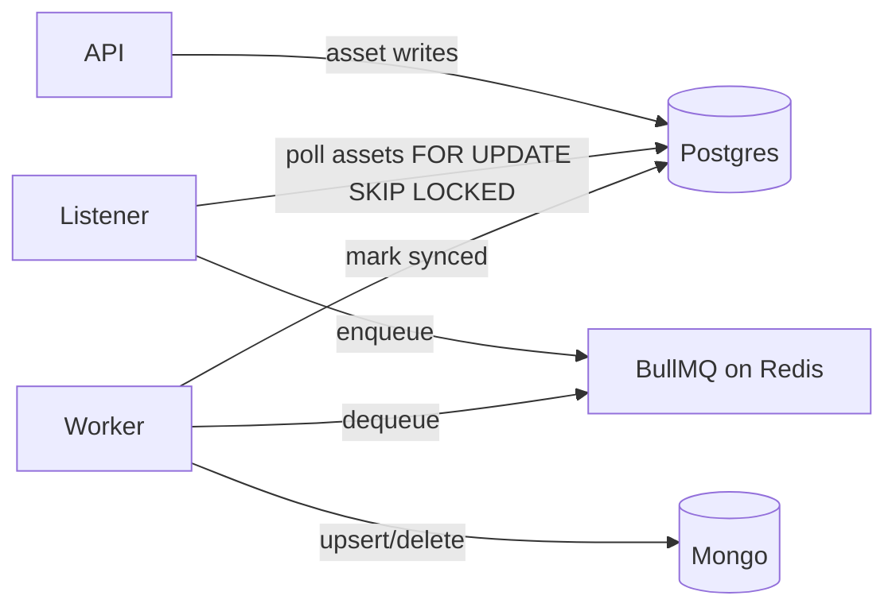
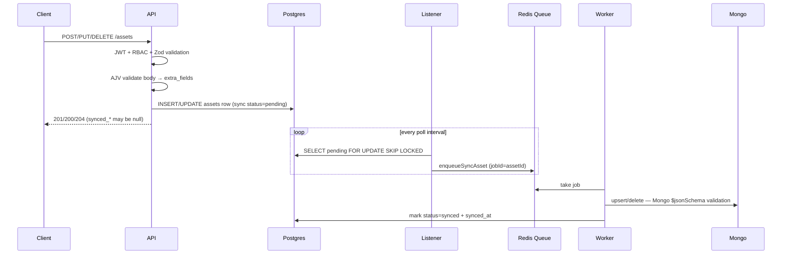
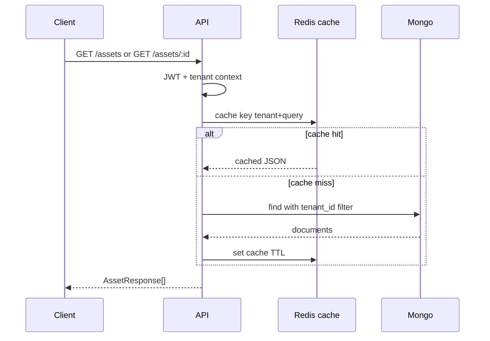
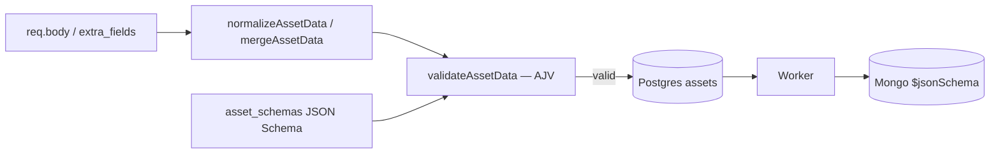
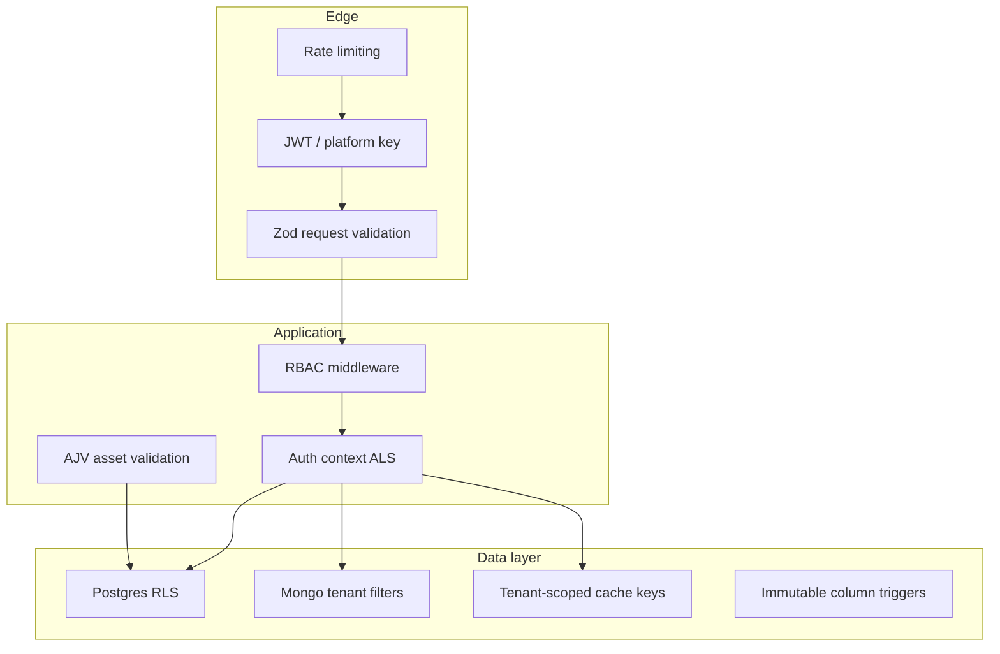
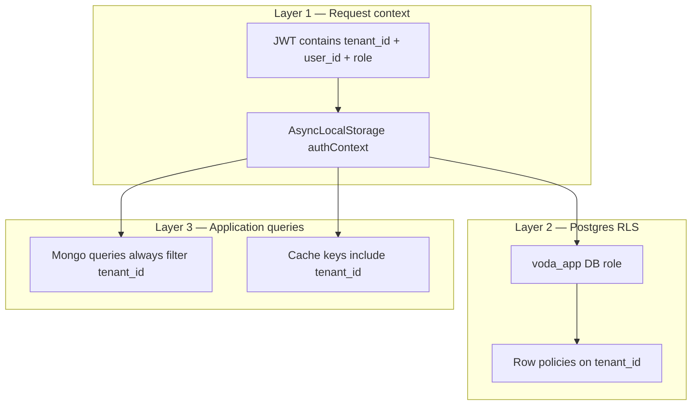

# Architecture & Design

This document explains how the multi-tenant asset service works end to end: components, data flow, security, patterns, and operational behavior. Reading it should give you the same mental model as walking through the codebase.

**Mental model (30 seconds):**

1. **Tenants** own **users** and **assets**. Every request is scoped to one tenant via JWT + Postgres RLS + Mongo/cache filters.
2. **Users** and **tenant metadata** live in Postgres only — reads and writes are immediate and consistent.
3. **Asset writes** go to Postgres first (`assets` row + embedded outbox, `status=pending`). The API responds from Postgres; sync fields may be null.
4. **Listener** polls pending rows and enqueues BullMQ jobs. **Worker** upserts/deletes Mongo and marks Postgres `synced`.
5. **Asset reads** (`GET /assets`, reports) use Mongo (+ Redis cache) — **eventual consistency** until the worker finishes.

To run the app locally or in Docker, see [README.md](./README.md).

---

## Table of contents

1. [System overview](#1-system-overview) — includes [tools & libraries](#tools--libraries)
2. [Process layout](#2-process-layout)
3. [Write path (create / update / delete)](#3-write-path-create--update--delete) — includes [sync idempotency](#34-sync-idempotency--asset-id-as-the-stable-key) and [Idempotency-Key header](#37-http-idempotency-key-header)
4. [Read path (list / get)](#4-read-path-list--get)
5. [Asset validation & dynamic metadata](#5-asset-validation--dynamic-metadata) — includes [geospatial sync](#54-geospatial-sync-contract)
6. [Patterns & why](#6-patterns--why)
7. [Caching](#7-caching)
8. [Security](#8-security)
9. [Error handling](#9-error-handling)
10. [Source layout](#10-source-layout)
11. [Production improvements](#11-production-improvements)

---

## 1. System overview

The service manages **tenants**, **users**, and **assets**. Each tenant is fully isolated: users and assets belong to exactly one tenant. Tenants can extend the base asset JSON Schema with custom fields (e.g. `material`, `diameter_mm`).

**Stores:**

| Store | Role |
|-------|------|
| **PostgreSQL** | ACID writes — source of truth for tenants, users, and asset mutations (embedded outbox), RLS |
| **MongoDB** | Asset **read model** — list/get, filters, aggregations (reports) |
| **Redis** | Response cache, rate-limit counters, BullMQ job queue |

### Tools & libraries

| Category | Tool | Why |
|----------|------|-----|
| **Runtime** | Node.js 20, TypeScript | Single language for API, listener, and worker; typed domain and HTTP layers |
| **HTTP** | Express | Thin routing and middleware; `createApp()` exported for supertest |
| **Postgres** | `pg` | Connection pool; scoped transactions set `app.current_tenant_id` for RLS |
| **Mongo** | `mongodb` driver | Read-model queries, aggregations, `$jsonSchema` collection validator |
| **Redis** | `ioredis` | Shared cache, rate-limit store, BullMQ backend |
| **Job queue** | BullMQ | Durable sync jobs with retries, `jobId = assetId` idempotency |
| **HTTP validation** | Zod | Request body/query/params at the edge (`schemas.ts`) |
| **Asset validation** | AJV + `ajv-formats` | Runtime JSON Schema from per-tenant `asset_schemas` rows |
| **Auth** | `jsonwebtoken`, `bcryptjs` | JWT tenant sessions; hashed passwords |
| **Rate limiting** | `express-rate-limit` + `rate-limit-redis` | Per-user/IP limits shared across API processes |
| **Config** | `dotenv` | Env-based secrets and connection URLs |
| **Process manager** | PM2 | One Docker container runs API + listener + worker |
| **Containers** | Docker Compose | Local full stack with healthchecks and auto-seed |
| **Tests** | Vitest, supertest | Unit + integration tests against real DBs |
| **Build / dev** | `tsc`, `tsx` | Compile for production; watch mode locally |

**Why two databases for assets?** Asset **writes** go to Postgres for **ACID** transactions (atomic writes, outbox polling, tenant onboarding). Asset **reads** (`GET /assets`, reports) go to Mongo for fast queries and aggregations on the synced projection. Postgres holds the write model; Mongo holds the read model, updated asynchronously by the worker.



---

## 2. Process layout

Three long-running processes (PM2 in Docker, or separate terminals locally):

| Process | Entry | Responsibility |
|---------|-------|----------------|
| **API** | `src/index.ts` | HTTP, auth, validation, handlers |
| **Listener** | `src/listener.ts` | Poll `assets` with `FOR UPDATE SKIP LOCKED`, enqueue sync jobs |
| **Worker** | `src/worker.ts` | Consume queue, upsert/delete Mongo, mark synced |



The API never writes assets directly to Mongo on the request path. That keeps HTTP latency predictable and gives at-least-once sync with retries via the queue.

### 2.1 Docker, PM2, seed, tests & defaults

| Topic | How it works |
|-------|----------------|
| **Docker** | `docker compose up --build` — Postgres (healthcheck), Redis, Mongo, one `app` container. Image runs **PM2** (`pm2-runtime ecosystem.config.cjs`): API + listener + worker from `dist/src/*.js`. |
| **PM2 / local** | Three processes: `server`, `listener`, `worker`. Locally: separate `npm run dev:*` terminals, or `npm run build && npm run start:pm2`. |
| **Seed** | `npm run seed` (`seed/index.ts`) uses privileged `DATABASE_URL`: `reset.sql` → `schema.sql` → demo tenants/users/assets. Seeded assets are **`synced`** in Postgres and written to Mongo directly (skip outbox). Docker sets `SEED_ON_START=true`. Password: `SEED_PASSWORD` (default `password123`). |
| **Default schema** | Base JSON Schema in `seed/schemas/default-asset.schema.json`. `POST /tenants` optional `asset_schema` `{ properties, required }` merges tenant fields into **`extra_fields`** (`buildTenantAssetSchema` in `lib/assetSchema.ts`); stored as `asset_schemas` version 1. |
| **JWT** | Login issues Bearer token. Payload: `sub`, `tenant_id`, `email`, `role`. `JWT_SECRET` + `JWT_EXPIRES_IN` (default `24h`). |
| **Tests** | Vitest + supertest. `createApp()` (`app.ts`) mounted in tests without binding a port. `tests/isolation.test.ts` runs `runSeed()` then checks auth, RBAC, tenant isolation. Unit tests: `validateAsset.test.ts`, `mergeAssetSchema.test.ts`. `npm test`. CI: `.github/workflows/ci.yml` (Postgres, Redis, Mongo service containers). |
| **BullMQ** | Queue `sync-asset`, `jobId = assetId`, 5 attempts, exponential backoff from 2s, `removeOnFail: false`. |

---

## 3. Write path (create / update / delete)

### 3.1 Flow diagram



### 3.2 Postgres asset row

On write, Postgres stores:

- `tenant_id`, `schema_version` — set on create, **immutable** (DB trigger)
- `data` — JSON blob: core attributes at root + tenant extensions in `extra_fields`
- `status` — **outbox sync state**: `pending` (awaiting worker) or `synced` — not business `ok/warning/critical` (those live in `data.status`)
- `action` — `upsert` or `delete` (delete tombstone flow)
- `modified_by` — user who performed the write
- `synced_at` — set when worker confirms Mongo sync
- `created_at` — row creation time

The `assets` table is both the **write model** and the **outbox control plane** — there is no separate outbox table.

### 3.3 Outbox polling

The listener polls `assets` where sync `status = 'pending'`:

```sql
SELECT id, tenant_id, modified_by
  FROM assets
 WHERE status = 'pending'
 ORDER BY created_at
 LIMIT $batch
 FOR UPDATE SKIP LOCKED;
```

- **`FOR UPDATE SKIP LOCKED`** — parallel listeners skip rows another poller has locked.
- Each poll runs in a short Postgres transaction (`queryWithoutTenantContext`); locks are released on commit, then matching rows are enqueued to BullMQ (`enqueueSyncAsset`, `jobId = assetId`).
- **Current demo:** rows stay `pending` until the worker marks them `synced` (no intermediate `processing` state). Duplicate enqueue for the same asset is safe — BullMQ replaces the job by `jobId`.

Production hardening for stuck rows and a `processing`/`failed` lifecycle is in [§11](#11-production-improvements).

### 3.4 Sync idempotency — asset `id` as the stable key

Sync jobs can be retried (worker crash, BullMQ backoff, duplicate enqueue). The system stays correct because **idempotency** is built into the pipeline: the Postgres **asset `id`** (UUID) is the single deduplication key from queue to Mongo.

| Layer | Key | Effect |
|-------|-----|--------|
| **BullMQ** | `jobId = assetId` | Re-enqueue for the same asset replaces the pending job instead of duplicating work |
| **Mongo** | `_id = asset.id` | `upsertAssetDocument` updates the existing document or inserts once — retries never create a second document |

Running the same sync job twice (or more) has the same end result as running it once: **one Mongo document per asset id**.

### 3.5 Delete path

Delete sets `action=delete` and sync `status=pending`. Worker removes the Mongo document and Postgres hard-deletes the row after processing (tombstone flow).

### 3.6 API response timing

Create/update responses are built from Postgres immediately. Fields `synced_at`, `synced_by`, and `updated_at` are **null** until the worker completes. Clients that need the read model should poll `GET /assets/:id` or wait briefly.

### 3.7 HTTP `Idempotency-Key` header

Safe **client retries** on create endpoints: if the network drops after the server handled a request, the client can retry with the same key and body and get the **original response** instead of creating a duplicate row.

Implemented in `middleware/idempotency.ts`.

| Endpoint | `Idempotency-Key` | Storage |
|----------|-------------------|---------|
| `POST /assets` | **Required** | Postgres `idempotency_keys` — `PRIMARY KEY (tenant_id, key)` |
| `POST /users` | Optional | same table (tenant-scoped, RLS) |
| `POST /tenants` | Optional | Redis `idempotency:platform:{key}` (no tenant yet) |

**Postgres table** (`idempotency_keys`): one row per tenant + key; stores `request_hash`, `status_code`, `response_body`, `expires_at`. Enforces uniqueness per tenant at the database level. Expired rows are ignored and deleted on read.

**Why required only on assets** — asset creates are the high-volume, retry-prone write path (Postgres + outbox + Mongo). User/tenant creates are rare; optional idempotency is enough there.

**Rules**

- Header format: 1–255 characters, `[\w-]` (letters, digits, `_`, `-`).
- Missing on `POST /assets` → `400` `Missing Idempotency-Key header`.
- Invalid format → `400` `Invalid Idempotency-Key`.
- Same key + **same body** → replay cached response (including cached `4xx` validation errors).
- Same key + **different body** → `409` `Idempotency key reused with different request body`.
- Concurrent duplicate while first request is running → `409` `Idempotency request in progress`.

**Not the same as optional `id` in the body** — `Idempotency-Key` is an HTTP header for retry safety; optional `id` on `POST /assets` lets the client choose the asset UUID. Both can be used together.

**Sync pipeline idempotency** (BullMQ `jobId`, Mongo `_id`) is separate — see [§3.4](#34-sync-idempotency--asset-id-as-the-stable-key).

---

## 4. Read path (list / get)

Asset reads are served from **MongoDB** (not Postgres). Postgres is only used on the write path; the worker projects accepted writes into Mongo for query-friendly access.



- **List:** filters `type`, `status`, pagination; Mongo query always includes `tenant_id`.
- **Get by id:** single document by `tenant_id` + `id`.
- **Reports:** `GET /reports/overview` — Postgres (tenant, users, schema) + Mongo (asset counts).

Cache keys are tenant-scoped. Writes invalidate cache entries — see [Caching](#7-caching).

---

## 5. Asset validation & dynamic metadata

Validation is **data-driven at runtime** — tenant constraints live as JSON Schema rows in Postgres, compiled and enforced by AJV on every write. No application redeploy is required to change tenant field rules.

### 5.1 Dynamic runtime metadata models

Asset attributes are split into immutable system tracking properties and structural tenant extensions. Instead of maintaining compiling schema versions or long-running database migrations, schema configuration is treated as **pure database rows**.

**Core attributes (root level):** Fields like `id`, `tenant_id`, `name`, `type`, `status`, `lat`, `lng`, and `installed_at` are strictly enforced by the core platform. They remain flat at the document surface in Postgres and API responses for simple filtering and indexing. Geospatial indexing in Mongo is handled on sync — see [§5.4](#54-geospatial-sync-contract).

**Extended fields (`extra_fields`):** Tenant-specific fields from onboarding are stored under `extra_fields` in `data`. The API accepts them at the top level or nested in `extra_fields`; `normalizeAssetData` / `mergeAssetData` normalize before storage.

During tenant onboarding (`POST /tenants`), validation rules are stored as JSON Schema in **`asset_schemas`** (one row per tenant, version 1, insert-once).

**Atomic onboarding transaction:** `createTenantWithAdmin()` wraps all provisioning in one Postgres transaction (`withBypassTransaction` in `tenantRepository.ts`):

1. `INSERT` tenant row (`tenants`)
2. `INSERT` JSON Schema row (`asset_schemas`)
3. `INSERT` first admin user (`users`)

If any step fails, the whole transaction rolls back — no orphaned tenant without a user or schema config. RLS is bypassed for this path only (no tenant context exists yet before the first user is created).

`tenant_id` and config binding on an asset row are **immutable** after create (DB triggers). Core platform fields cannot be overridden by tenant extensions.

### 5.2 Decoupled AJV validation engine

Rather than relying on application code changes, business validation is fully schema-driven and executed at the Express service boundary via **AJV** (Another JSON Schema Validator) in `lib/assetSchema.ts`:

| Step | Function | Purpose |
|------|----------|---------|
| Load config | `findLatestAssetSchema()` / `findAssetSchemaByVersion()` | Read JSON Schema from `asset_schemas` |
| Normalize | `normalizeAssetData()` / `mergeAssetData()` | Server sets `id`, `tenant_id`; merges client fields into `extra_fields` |
| Compile | `compileAssetValidator()` | Build AJV validator from stored JSON Schema |
| Validate | `validateAssetData(schema, data)` | Runtime check against tenant rules |

**Create (`POST /assets`)** — load current tenant config, normalize body, AJV validate, write Postgres with `status=pending`.

**Update (`PUT /assets/:id`)** — load asset’s bound `schema_version` config, merge patch via `mergeAssetData`, AJV validate, write Postgres (`status=pending`, `synced_at` cleared).

Failed validation → `400` with `{ "error": "Asset validation failed", "details": [...] }`.



### 5.3 Mongo collection validator (second layer)

When the sync worker writes to Mongo, documents pass a **second validation** — Mongo’s native **`$jsonSchema`** collection validator on the `assets` collection (`assetMongoRepository.ts`, applied via `ensureAssetIndexes()`).

| Layer | Where | What it checks |
|-------|-------|----------------|
| **1 — AJV (API)** | `POST` / `PUT` handlers | Full tenant JSON Schema: core fields + `extra_fields` rules |
| **2 — Mongo `$jsonSchema`** | `upsertAssetDocument()` | Document shape: required keys, BSON types, `status` enum, `location` GeoJSON Point, no extra top-level properties |

The Mongo validator is **structural** — it enforces document shape and types, but does **not** re-run tenant-specific rules inside `extra_fields` (already enforced by AJV before Postgres accepts the write).

If Mongo validation fails, the worker job errors and BullMQ retries. In normal operation, AJV on the API path prevents invalid data from reaching Postgres, so Mongo validation acts as a **safety net** on the read model.

The end-to-end path is: **client payload → AJV (tenant config) → Postgres write model → worker → Mongo structural validator → read model.**

### 5.4 Geospatial sync contract

MongoDB **2dsphere** indexes require **GeoJSON**, not flat `lat` / `lng` fields. Postgres and the API keep coordinates flat; the **sync worker** (`assetMongoRepository.toDocument` / `buildGeoJsonPoint`) maps them when projecting to the read model.

| Store | Coordinate shape | Notes |
|-------|------------------|--------|
| Postgres `assets.data` | Flat `lat`, `lng` | AJV-validated on write |
| API `AssetResponse` | Flat `lat`, `lng` | No `location` in JSON responses |
| Mongo `assets` collection | Flat `lat`, `lng` **plus** `location` GeoJSON | Set on every upsert |

**Sync mapping** (`buildGeoJsonPoint` in `assetMongoRepository.ts`):

```json
"location": { "type": "Point", "coordinates": [lng, lat] }
```

- **Longitude first** in `coordinates` (GeoJSON convention).
- If either `lat` or `lng` is missing → `location: null`.
- Mongo **`$jsonSchema`** (§5.3) validates `location` as a Point object or `null`.
- `location` is stripped from `MongoAssetRecord` / API mapping — internal to Mongo only.

**Index** (created in `ensureAssetIndexes()`):

```javascript
{ tenant_id: 1, location: "2dsphere" }, { sparse: true, name: "tenant_location_2dsphere" }
```

Sparse so documents without coordinates do not bloat the geo index. Compound with `tenant_id` keeps geospatial queries tenant-scoped.

There is **no** `GET /assets` radius or `$geoNear` endpoint yet — the index is ready when that API is added.

---

## 6. Patterns & why

| Pattern | Where | Why |
|---------|-------|-----|
| **Repository** | `repositories/*` | Hide SQL/Mongo behind stable interfaces per store |
| **Service layer** | `services/*` | Business rules, orchestration, error mapping |
| **Outbox** | `assets` table + listener | Embedded control plane; poll `pending` + BullMQ enqueue |
| **Transactional onboarding** | `createTenantWithAdmin` | Tenant + schema config + admin user in one `BEGIN/COMMIT` |
| **CQRS (light)** | PG write / Mongo read | Optimize each path independently |
| **Read model sync** | Worker + BullMQ | Retryable projection updates; **idempotency** via `asset.id` → Mongo `_id` |
| **AsyncLocalStorage context** | `authContext` | Tenant/user available deep in stack without parameter drilling |
| **RLS** | Postgres policies | Defense in depth for multi-tenant SQL |
| **Zod validation** | `schemas.ts` + `validateRequest` | HTTP input validation separate from domain types (`types.ts`) |
| **AppError** | `lib/appError.ts` | Consistent HTTP error shape |
| **Response DTOs** | `lib/responses.ts` | API shapes decoupled from DB rows |

We did **not** use full event sourcing: the outbox is only for sync jobs, not a public event log.

---

## 7. Caching

Redis caches **read responses** for users and assets so repeated `GET` requests avoid hitting Postgres or Mongo on every call. Implemented in `lib/cache.ts`.

### What is cached

| Resource | Cached endpoints | Key includes |
|----------|------------------|--------------|
| **Assets** | `GET /assets` (list), `GET /assets/:id` | `tenant_id` + query params or asset `id` |
| **Users** | `GET /users` (list), `GET /users/:id` | `tenant_id` + pagination or user `id` |

Reports are **not** cached.

### When entries expire

Every cached value is stored with a **TTL** (time-to-live):

- Default: **60 seconds** (`CACHE_TTL_SECONDS` env var, default `60`)
- Redis command: `SET key value EX <TTL_SECONDS>`
- After TTL, the key is deleted automatically — the next request is a cache miss and reloads from the database

So a cached response lives for up to **60 seconds** (or whatever you configure), unless invalidated earlier.

### When entries are invalidated (removed early)

Cache is cleared **before TTL** when data changes, so clients do not read stale data for long:

| Event | Invalidation |
|-------|----------------|
| User create / update / delete | All user cache keys for that tenant (`invalidateTenantUsers`) |
| Asset create / update / delete (API) | All asset cache keys for that tenant (`invalidateTenantAssets`) |
| Asset sync (worker) | Same — worker calls `invalidateTenantAssets` after Mongo upsert/delete |

Invalidation uses `SCAN` + `DEL` on keys matching `tenant:{tenantId}:{resource}:*`.

### Cache key shape

```
tenant:{tenantId}:assets:{hash of sorted query params}
tenant:{tenantId}:users:{hash of sorted query params}
```

The hash covers `type`, `status`, `limit`, `offset` for asset lists, or `id` for single-resource keys. Tenant id in the key prevents cross-tenant cache leaks (see [Security](#8-security)).

---

## 8. Security

Security is layered: authentication, authorization, tenant isolation, input validation, rate limiting, and safe defaults at the database.

| Measure | Section | Summary |
|---------|---------|---------|
| Tenant isolation | [§8.1](#81-tenant-isolation) | JWT context, RLS, Mongo/cache tenant filters |
| Authentication | [§8.2](#82-authentication) | JWT Bearer, platform `x-admin-key`, public routes |
| RBAC | [§8.3](#83-role-based-access-control-rbac) | `admin` / `editor` / `viewer` role gates |
| Credential storage | [§8.4](#84-credential-storage) | bcrypt passwords, secrets in env only |
| Input validation | [§8.5](#85-input-validation) | Zod (HTTP), AJV (assets), Mongo `$jsonSchema` |
| Database hardening | [§8.6](#86-database-hardening) | RLS, immutable triggers, least-privilege grants |
| Rate limiting | [§8.2](#82-authentication) | `express-rate-limit` + Redis; per user/IP |
| Safe error responses | [§8.7](#87-safe-error-responses) | No stack traces in API JSON |



### 8.1 Tenant isolation

Data from one tenant must never appear in another tenant’s responses. Enforced in **three layers**:



- **JWT + AsyncLocalStorage** — Login issues a JWT with `sub`, `tenant_id`, and `role`. Middleware (`middleware/auth.ts`) verifies the token and stores context in `lib/authContext.ts`. Repositories read `tenantId` from context; clients cannot override tenant scope via the request body.
- **Postgres RLS** — API uses `APP_DATABASE_URL` (`voda_app` role, not superuser). Row policies restrict `users`, `assets`, etc. to the current tenant. Superuser / seed connections bypass RLS only for migrations and seeding.
- **Mongo** — `assetMongoRepository` always filters by `tenant_id` from auth context.
- **Cache** — Keys are prefixed with `tenant:{tenantId}:…`.
- **Tests** — `tests/isolation.test.ts` verifies cross-tenant access fails.

### 8.2 Authentication

| Mode | Routes | Mechanism |
|------|--------|-----------|
| **Public** | `GET /health`, `POST /auth/login` | No token |
| **JWT Bearer** | All tenant-scoped routes | `Authorization: Bearer <token>` |
| **Platform key** | `POST /tenants` | `x-admin-key: PLATFORM_ADMIN_KEY` |

- JWT middleware (`requireAuthUnlessPublic`) runs on every request except JWT-exempt paths in `middleware/auth.ts`.
- Platform provisioning uses a shared secret header, separate from tenant JWTs — avoids needing a tenant before the first tenant exists (`middleware/platformAdmin.ts`).
- Invalid or missing credentials → `401`. Tokens signed with `JWT_SECRET` (`lib/jwt.ts`).
- **Rate limiting** — `express-rate-limit` + Redis (`middleware/rateLimit.ts`). Default 100 requests/minute; per user when authenticated, per IP on public routes. `/health` skipped → `429`.
- **Idempotency keys** — see [§3.7](#37-http-idempotency-key-header).

### 8.3 Role-based access control (RBAC)

Three roles per tenant: `admin`, `editor`, `viewer`.

| Capability | admin | editor | viewer |
|------------|:-----:|:------:|:------:|
| Users create/update/delete | ✓ | ✗ | ✗ |
| Users list/get | ✓ | ✓ | ✓ |
| Tenant update | ✓ | ✗ | ✗ |
| Assets create/update/delete | ✓ | ✓ | ✗ |
| Assets list/get | ✓ | ✓ | ✓ |
| Reports | ✓ | ✓ | ✓ |

Enforced by `middleware/authorize.ts`:

- `requireAdmin` — tenant `PUT`, user mutations
- `requireWrite` — asset mutations (admin + editor)

Denied actions → `403`.

### 8.4 Credential storage

- User passwords hashed with **bcrypt** before storage (`lib/password.ts`). Plain passwords never stored or returned in API responses.
- `PLATFORM_ADMIN_KEY` and `JWT_SECRET` are env secrets — not in code or responses.

### 8.5 Input validation

| Layer | Tool | Where | Purpose |
|-------|------|-------|---------|
| HTTP body/query/params | **Zod** | `schemas.ts` + `validateRequest` | Shape of API inputs (emails, UUIDs, pagination) |
| Asset business rules | **AJV** | `lib/assetSchema.ts` | Tenant JSON Schema on every asset create/update |
| Mongo documents | **$jsonSchema** | `assetMongoRepository` | Structural validation on sync (see [§5.3](#53-mongo-collection-validator-second-layer)) |

Invalid input → `400` with `{ error, details? }` — no write to Postgres.

### 8.6 Database hardening

- **Tenant context via AsyncLocalStorage** — the caller’s `tenant_id` is never taken from the request body or route params for authorization. Flow:

  1. JWT middleware verifies the token and stores `tenantId`, `userId`, and `role` in **AsyncLocalStorage** (`lib/authContext.ts`).
  2. Repositories read `getTenantId()` from that context — handlers and services do not pass `tenant_id` as an untrusted application parameter.
  3. **Postgres** — every scoped query runs inside a short transaction that sets `app.current_tenant_id` from AsyncLocalStorage (`clients/postgres.ts` → `query()`). RLS policies filter rows automatically; most `SELECT`/`UPDATE`/`DELETE` SQL does not need `tenant_id` in the query string because the session variable enforces scope. `INSERT` statements set `tenant_id` from `getTenantId()` (required `NOT NULL` column, still must match RLS `WITH CHECK`).
  4. **Mongo** — repositories explicitly add `tenant_id: getTenantId()` to every filter (Mongo has no RLS).

  This keeps tenant scoping consistent deep in the stack without trusting client-supplied tenant ids.

- **RLS** on tenant-scoped Postgres tables (see §8.1).

- **Immutable columns and triggers** — even if the API has a bug or a node is compromised, Postgres rejects illegal identity changes at the database layer. A bad deploy cannot rewrite `tenant_id` foreign keys to leak or migrate data across tenants.

| Table | What cannot change after create | Enforcement | What can change |
|-------|--------------------------------|-------------|-----------------|
| **users** | `tenant_id` | Trigger `users_tenant_id_immutable` | `name`, `password_hash`, `role` (via API + RBAC). **Email is not updatable** via API. |
| **assets** | `tenant_id`, `schema_version` | Trigger `assets_identity_immutable` | `data`, sync/outbox fields, `modified_by` |
| **asset_schemas** | **Entire row** — no updates, no deletes | See below (triple lock) | nothing — insert-once at tenant onboarding |
| **tenants** | `id` (implicit PK) | — | `name`, `slug` — **admins** via `PUT /tenants/current` |

**`asset_schemas` immutability (triple lock)**

Tenant validation config is a **strict insert-once reference** after onboarding:

1. **Role grants** — `voda_app` cannot mutate schema rows:

   ```sql
   REVOKE UPDATE, DELETE ON asset_schemas FROM voda_app;
   ```

   The API role can `SELECT` its tenant’s config and cannot change or remove it through normal grants.

2. **Triggers** — `asset_schemas_no_update` and `asset_schemas_no_delete` run `BEFORE UPDATE` / `BEFORE DELETE` and raise an exception for **any** row touch, including superuser sessions. Schema drift cannot happen via SQL even if grants were misconfigured.

3. **RLS** — `asset_schemas_insert` allows `INSERT` only when `app.bypass_rls()` is true (platform onboarding transaction). Tenant-scoped JWT sessions can read (`asset_schemas_select`) but never insert a second config row through the app role.

Together: onboarding writes the JSON Schema once; runtime validation always reads that frozen row.

**Trigger defense against cross-tenant reassignment**

- **`users.tenant_id_immutable`** — a user cannot be moved to another tenant after create. Even a compromised API process that skips application checks cannot `UPDATE users SET tenant_id = …` to access another tenant’s JWT context or user records.
- **`assets_identity_immutable`** — `tenant_id` and `schema_version` on asset rows cannot change. An attacker cannot re-home assets into another tenant’s Mongo read model or re-bind them to a different validation config.

Mongo mirrors this for synced assets: `upsertAssetDocument` rejects `tenant_id` and `schema_version` changes on existing documents.

- **Least privilege (`voda_app` grants)** — not the same for every table:

| Table | `voda_app` can UPDATE/DELETE? | Notes |
|-------|------------------------------|--------|
| `asset_schemas` | **No** (`REVOKE UPDATE, DELETE`) + triggers | Insert-once at tenant create (`withBypassTransaction` only) |
| `tenants` | **Yes** (within RLS) | Tenant **metadata** (`name`, `slug`) — not the same as locking the row |
| `users`, `assets` | **Yes** (within RLS) | Scoped to current tenant; `users.tenant_id` and asset identity still immutable via triggers |

Tenant **admins** can update organization `name` / `slug`. Users cannot change `tenant_id`. Nobody can alter `asset_schemas` after provisioning — that table is the most tightly locked object in the schema.

**Soft delete (users only)**

`DELETE /users/:id` does **not** remove the Postgres row. It sets `deleted_at = NOW()` (`userRepository.deleteUser`). Only **users** use soft delete; assets are removed from Mongo by the worker and **hard-deleted** from Postgres after the delete tombstone is processed.

**Why soft delete users?**

| Reason | Detail |
|--------|--------|
| **Referential integrity** | `assets.created_by`, `assets.modified_by`, and sync metadata (`synced_by`) reference `users(id)`. Hard-deleting a user would break FK constraints or force `ON DELETE CASCADE`, wiping audit history on asset rows. |
| **Audit trail** | Deleted users remain in the database so you still know who created or modified assets and who triggered a sync. |
| **Auth boundary** | Login and all reads filter `deleted_at IS NULL` — a soft-deleted user cannot authenticate or appear in `GET /users`. |
| **Email reuse** | Partial unique index `idx_users_email_active` applies only to active users (`WHERE deleted_at IS NULL`), so the same email can be assigned to a new user after the old account is soft-deleted. |

Soft-deleted users are excluded from list, get, login, reports (`countUsersByRole`), and the partial indexes above. There is no “undelete” API in the demo; production might add admin restore or a retention job to purge rows after N years.

**Indexes (Postgres and Mongo)**

Indexes match the queries the API, listener, and worker actually run. Primary keys and `UNIQUE` constraints (`tenants.slug`, `asset_schemas.tenant_id`, `users.email` among active rows) provide implicit lookup paths.

**PostgreSQL** (`seed/schema.sql`)

| Index | Table | Columns / predicate | Serves |
|-------|-------|---------------------|--------|
| PK / `UNIQUE` | `tenants` | `id`, `slug` | Tenant lookup, slug conflict checks |
| PK / `UNIQUE` | `asset_schemas` | `(tenant_id, version)`, `tenant_id` | `findLatestAssetSchema`, `findAssetSchemaByVersion` |
| PK | `users`, `assets` | `id` | `GET /users/:id`, `findAssetById`, asset updates |
| `idx_users_email_active` | `users` | `email` WHERE `deleted_at IS NULL` | Login (`findUserByEmail`), unique active email |
| `idx_users_tenant_id` | `users` | `tenant_id` | RLS tenant scans (legacy; composite indexes below are preferred) |
| `idx_users_tenant_created` | `users` | `(tenant_id, created_at)` | User list ordering |
| `idx_users_tenant_active_created` | `users` | `(tenant_id, created_at)` WHERE `deleted_at IS NULL` | `GET /users` list, report `countUsersByRole` |
| `idx_assets_tenant_id` | `assets` | `tenant_id` | RLS on write path (reads are Mongo) |
| `idx_assets_pending` | `assets` | `created_at` WHERE `status = 'pending'` | Outbox listener poll (`ORDER BY created_at`, `FOR UPDATE SKIP LOCKED`) |

Asset **reads** are not indexed in Postgres beyond PK — the Mongo read model carries query indexes.

**MongoDB** (`assetMongoRepository.ensureAssetIndexes()`)

| Index | Keys | Serves |
|-------|------|--------|
| `tenant_created_at` | `{ tenant_id: 1, created_at: -1 }` | `GET /assets` default list sort |
| `tenant_type` | `{ tenant_id: 1, type: 1 }` | `GET /assets?type=…` |
| `tenant_status` | `{ tenant_id: 1, status: 1 }` | `GET /assets?status=…`, report status aggregates |
| `tenant_location_2dsphere` | `{ tenant_id: 1, location: "2dsphere" }` sparse | Geospatial queries per tenant (§5.4); no search API yet |
| `_id` (default) | asset UUID | `GET /assets/:id` |

Report aggregations (`$group` by `status`, `schema_version`) use `tenant_id` `$match` — covered by the compound indexes above; at very large scale consider `{ tenant_id: 1, schema_version: 1 }`.

**Not indexed today (acceptable for demo scale)**

| Query | Why it is OK now | Production follow-up |
|-------|------------------|----------------------|
| `assets` by `tenant_id` only in Postgres | Writes by PK; reads in Mongo | Keep as-is unless Postgres fallback reads grow |
| Mongo geo radius search | Index exists (§5.4); no HTTP API | `GET /assets?near=…` or `$geoWithin` endpoint |
| `processing` rows stuck recovery | Low volume | See [§11](#11-production-improvements) |

### 8.7 Safe error responses

Unhandled errors log server-side but return a generic `500` message — no stack traces or internal details in JSON responses (`app.ts` error handler).

---

## 9. Error handling

Central flow:

1. Zod / `validateRequest` → `400` + flattened `details`
2. `AppError` in services → mapped status + `{ error, details? }`
3. Unhandled → `500` + generic message (no stack in response)

Common statuses: `400` validation, `401` auth, `403` RBAC, `404` not found, `409` conflict, `429` rate limit.

Asset schema validation failures return `400` with structured `details` from JSON Schema validation.

---

## 10. Source layout

Lean, store-native layout — each process has a single entry file; data access is isolated per database.

```
src/
  index.ts              API server entry
  listener.ts           Concurrency-safe outbox poller (assets FOR UPDATE SKIP LOCKED)
  worker.ts             Mongo sync consumer (BullMQ)
  app.ts                Express wiring + global middleware

  clients/              Database connections (postgres, mongo, redis)
  lib/                  Cross-cutting: jwt, authContext, password, cache,
                        assetSchema (AJV), responses, appError
  middleware/           auth, authorize, validateRequest (Zod), rateLimit,
                        platformAdmin, idempotency, asyncHandler
  repositories/         One repository per store / aggregate
                          assetRepository.ts      Postgres write model + outbox polling
                          assetMongoRepository.ts Mongo read model + $jsonSchema validator
                          tenantRepository.ts     tenants + asset_schemas
                          userRepository.ts       users (RLS-scoped)
                          idempotencyRepository.ts tenant idempotency keys (Postgres)
  routes/               Thin HTTP handlers: auth, tenants, users, assets, reports
  services/             Business logic: auth, tenant, user, asset, report
  worker/
    syncAsset.ts        BullMQ queue definition + enqueueSyncAsset

  schemas.ts            Zod HTTP input schemas
  types.ts              Domain types (Asset, User, Tenant, …)
```

**Data flow summary:**

1. **Tenant onboarding** (`POST /tenants`) — single transaction: tenant + `asset_schemas` + admin user (rollback on any failure; RLS bypass).
2. **User CRUD** → Postgres only (RLS + triggers).
3. **Asset write** → Zod → AJV (`extra_fields`) → Postgres `assets` (`pending`) → listener poll → BullMQ → worker → Mongo `$jsonSchema` → `synced`.
4. **Asset read** → Redis cache → Mongo (tenant-scoped query).
5. **Report** → Postgres metadata + Mongo aggregations.

---

## Quick reference: consistency expectations

| Operation | Immediate source | Fully consistent when |
|-----------|------------------|------------------------|
| Login / users | Postgres | Same request |
| Asset write response | Postgres | Sync fields null until worker |
| Asset read | Mongo | After worker sync |
| Report asset counts | Mongo | After worker sync |

This is **eventual consistency** between Postgres write model and Mongo read model, typically seconds under normal load.

---

## 11. Production improvements

Demo scope only — not implemented. A production deployment would likely add:

- Atomic outbox (poll + enqueue in one transaction, or `processing`/`failed` states)
- DLQ and failed-job alerting for stuck syncs
- Sync lag SLOs and alerts (pending age, queue depth, failed jobs)
- Kafka or event bus instead of polling outbox
- Production observability beyond basic logs (metrics, tracing, alerting)
- Readiness probes beyond `/health` (Postgres, Mongo, Redis, worker lag)
- Separate Kubernetes deployments for API, listener, and worker (scale independently)
- Connection pool limits across replicas (Postgres `max_connections` budget)
- Graceful shutdown on pod rollouts (drain HTTP, close pools, finish jobs)
- Horizontal scaling on Kubernetes (replicas, sharding where needed)
- Postgres read-your-writes fallback for unsynced assets
- Secret management and tested backups/DR runbooks
- Cursor pagination for large asset lists
- More exhaustive test coverage (chaos / failure paths)
- OAuth, SSO, or external identity provider
- …and many more

---

**Author:** [Yannis Kolovos](https://msroot.me/) · June 2026
